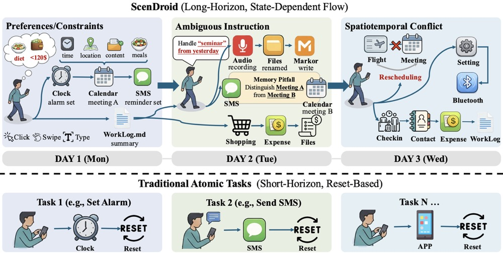
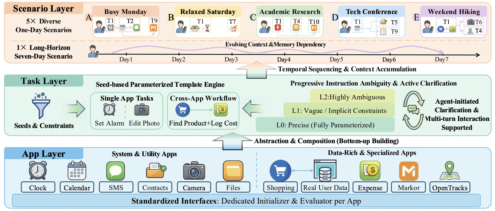

# ScenDroid

**A Scenario-Level Benchmark for Long-Horizon, Time-Evolving Android GUI Agents**

*Paper published at the [Lifelong Agent Workshop](https://sites.google.com/view/lifelongagentworkshop) @ ICLR 2026*

---

## Motivation

Existing Android GUI agent benchmarks evaluate agents on isolated, single-step atomic tasks with environment resets between each task. ScenDroid moves beyond this paradigm by introducing **scenario-level evaluation** — coherent, multi-app, multi-step task sequences that unfold over simulated daily and weekly timelines, with a persistent environment and evolving state.

<p align="center">
  
</p>

## Overview

Built on top of [AndroidWorld](https://github.com/google-research/android_world) and [WebArena](https://github.com/web-arena-x/webarena), ScenDroid introduces:

- **20 apps** and **5 daily + 1 weekly scenario**, totaling over **1,200 evaluation steps**.
- A novel **ATS (App-Task-Scenario) three-layer architecture** that organizes evaluation from individual app operations to cross-app task chains to full-day/week scenarios.
- A **persistent environment** with no per-task reset, requiring agents to handle accumulated state changes, inter-task dependencies, and evolving context.
- A **Progressive Ambiguity Taxonomy** with three clarity levels (L0, L1, L2) paired with an Interactive User Simulator to evaluate agent robustness under vague or incomplete instructions.

### ATS Architecture

<p align="center">
  
</p>

The ATS architecture decomposes evaluation into three layers:
- **App Layer**: Standardized interfaces with dedicated initializers and evaluators for each of the 20 supported apps (Clock, Calendar, SMS, Contacts, Camera, Files, Shopping, Expense, Markor, OpenTracks, etc.).
- **Task Layer**: Seed-based parameterized template engine that generates single-app tasks and cross-app workflows, with progressive instruction ambiguity (L0 → L1 → L2).
- **Scenario Layer**: Five diverse one-day scenarios (Busy Monday, Relaxed Saturday, Academic Research, Tech Conference, Weekend Hiking) and one long-horizon seven-day scenario (OmniLife), featuring evolving context, memory dependency, and temporal sequencing.

## Prerequisites

- **Operating System**: Linux with KVM support
- **GPU**: NVIDIA GPU with compatible drivers
- **Docker**: Docker Engine installed and running
- **Python**: Python 3.11+

## Quick Start

### 1. Install ScenDroid

```bash
pip install -e .
```

Verify the installation:

```bash
python -c "import scendroid; print('ScenDroid installed successfully')"
```

### 2. Environment Variables

ScenDroid uses environment variables for API keys and service configuration. Create a `.env` file or export them directly:

```bash
# Required: API key for the agent model (e.g., DashScope for Qwen3-VL)
export DASHSCOPE_API_KEY="your-dashscope-api-key"

# Optional: For LLM-assisted evaluation (information retrieval tasks)
export OPENAI_API_KEY="your-openai-compatible-api-key"
export OPENAI_BASE_URL="https://api.openai.com/v1"

# Shopping environment (auto-configured by restart_shopping_docker.sh)
export SHOPPING="http://localhost:7770"
export SHOPPING_ADMIN="http://localhost:7770/admin"
```

### 3. Shopping Environment (Docker)

ScenDroid integrates a shopping website powered by [WebArena](https://github.com/web-arena-x/webarena). The Docker image can be downloaded from the [WebArena environment setup guide](https://github.com/web-arena-x/webarena/blob/main/environment_docker/README.md):

```bash
# Download from one of the WebArena mirrors:
#   https://drive.google.com/file/d/1gxXalk9O0p9eu1YkIJcmZta1nvvyAJpA/view?usp=sharing
#   https://archive.org/download/webarena-env-shopping-image
#   http://metis.lti.cs.cmu.edu/webarena-images/shopping_final_0712.tar

docker load --input shopping_final_0712.tar
docker run --name shopping -p 7770:80 -d shopping_final_0712
```

After starting the container, configure the base URL (replace `<your-hostname>` with your server's hostname or IP):

```bash
docker exec shopping /var/www/magento2/bin/magento setup:store-config:set \
    --base-url="http://<your-hostname>:7770"
docker exec shopping mysql -u magentouser -pMyPassword magentodb \
    -e 'UPDATE core_config_data SET value="http://<your-hostname>:7770/" WHERE path = "web/secure/base_url";'
docker exec shopping /var/www/magento2/bin/magento cache:flush
```

Or use the provided convenience script:

```bash
./restart_shopping_docker.sh -e 5554
```

### 4. Android Emulator Setup

> **Note**: A pre-configured emulator image (AVD + SDK) with all 20 apps pre-installed will be released on 🤗 Hugging Face. See the [Roadmap](#roadmap) below.

If you already have an Android emulator configured, start it with:

```bash
$ANDROID_SDK_ROOT/emulator/emulator -avd Pixel_6a_API_33 \
    -port 5554 \
    -grpc 8554 \
    -no-snapshot \
    -gpu swiftshader_indirect \
    -no-audio \
    -no-window &
```

Verify the emulator is running:

```bash
$ANDROID_SDK_ROOT/platform-tools/adb devices
# Expected output: emulator-5554    device
```

## Usage

### Interactive TUI Mode

Launch the interactive terminal user interface for step-by-step testing and debugging:

```bash
python run_layered_tui_test.py \
    --console_port 5554 \
    --grpc_port 8554
```

The TUI provides a guided interface for selecting scenarios, tasks, agents, and ambiguity levels, with real-time observation of agent behavior.

### Batch Testing Mode

Run automated batch evaluations across scenarios:

```bash
python run_scenario_batch.py \
    --agent qwen3vl-8b \
    --scenarios a b c \
    --level L0 \
    --console_port 5554 \
    --grpc_port 8554
```

**Arguments:**

| Argument | Description | Default |
|---|---|---|
| `--agent` | Agent identifier (e.g., `qwen3vl-235b`, `qwen3vl-8b`) | Required |
| `--scenarios` | Scenario IDs to evaluate (e.g., `a b c d e omnilife`) | Required |
| `--level` | Instruction ambiguity level: `L0`, `L1`, or `L2` | Original |
| `--console_port` | Emulator console port | 5554 |
| `--grpc_port` | Emulator gRPC port | 8554 |
| `--reset_mode` | Enable per-task reset mode (for baseline comparison) | Off |
| `--auto_confirm` | Skip confirmation prompts | Off |
| `--start_from_subtask` | Resume from a specific subtask ID | None |

### Currently Supported Agents

In this initial release, we provide the basic single-model agent:

| Agent Flag | Model | Description |
|---|---|---|
| `qwen3vl-235b` | Qwen3-VL 235B | Single-model agent via DashScope API |
| `qwen3vl-32b` | Qwen3-VL 32B | Single-model agent via DashScope API |
| `qwen3vl-8b` | Qwen3-VL 8B | Single-model agent via DashScope API |

> Additional agents (dual-model, context-enhanced, ask-enabled variants, and more) will be released in future updates. See the [Roadmap](#roadmap).

### Instruction Ambiguity Levels

ScenDroid evaluates agents under three progressively ambiguous instruction levels:

- **L0 (Precise)**: All parameters are explicitly specified.
  *Example: "Set an alarm for 7:00 AM with label 'Morning Standup'."*
- **L1 (Parametric Omission)**: Some parameters are omitted, requiring the agent to explore or ask clarifying questions.
  *Example: "Set a morning alarm."*
- **L2 (Indirect Intent)**: Instructions express high-level intent without specifying concrete actions.
  *Example: "I need to wake up early for an important meeting tomorrow."*

At L1 and L2 levels, the Interactive User Simulator is activated to respond to agent clarification requests.

### Reset Mode

The `--reset_mode` flag enables per-task reset for baseline comparison experiments:

- **Default (off)**: Persistent environment across all tasks within a scenario. This is the standard ScenDroid evaluation mode.
- **Reset mode (on)**: Each task is independently initialized with L0 instructions, no state persistence, and no task dependencies. This mimics traditional atomic task benchmarks like AndroidWorld.

## Port Configuration

When running multiple emulator instances in parallel, ports are assigned systematically:

| Emulator Port | gRPC Port | Shopping Docker Port |
|---|---|---|
| 5554 | 8554 | 7770 |
| 5556 | 8556 | 7772 |
| 5558 | 8558 | 7774 |
| 5560 | 8560 | 7776 |
| 5562 | 8562 | 7778 |
| 5564 | 8564 | 7780 |

**Formulas:**
- gRPC port = emulator port + 3000
- Shopping Docker port = 7770 + (emulator port - 5554)

## Project Structure

```
scendroid/
├── run_scenario_batch.py            # Batch evaluation entry point
├── run_layered_tui_test.py          # Interactive TUI entry point
├── tui_interface.py                 # TUI rendering module
├── scenario_tasks.json              # Scenario-level task definitions
├── layered_tasks.json               # Task-level definitions
├── restart_shopping_docker.sh       # Shopping Docker restart utility
├── scendroid/                       # Core Python package
│   ├── agents/                      # Agent implementations
│   │   ├── base_agent.py            #   Base agent class
│   │   ├── qwen3vl_agent.py         #   Qwen3-VL single-model agent
│   │   └── ...                      #   Agent utilities
│   ├── apps/                        # App evaluators and scenarios
│   │   ├── registry.py              #   App registration
│   │   ├── scenario/                #   Scenario evaluators (A-E, OmniLife)
│   │   ├── clock/, contacts/, ...   #   Per-app task evaluators (20 apps)
│   │   └── shopping/                #   Shopping app tasks (WebArena-based)
│   ├── env/                         # Environment management
│   │   ├── env_launcher.py          #   Environment launcher
│   │   ├── scendroid_controller.py  #   Main environment controller
│   │   └── setup_device/            #   Device setup utilities
│   ├── task_evals/                  # Task evaluation infrastructure
│   │   ├── webarena/                #   WebArena shopping integration
│   │   ├── single/                  #   Single-app task evaluators
│   │   └── information_retrieval/   #   Information retrieval tasks
│   └── utils/                       # Shared utilities
├── utils/                           # External utility modules
├── webarena/                        # WebArena evaluation harness
├── setup.py                         # Package setup
├── pyproject.toml                   # Project metadata
├── requirements.txt                 # Python dependencies
└── LICENSE                          # Apache 2.0 License
```

## Roadmap

- [x] Core ATS three-layer evaluation framework (App / Task / Scenario)
- [x] 6 scenarios (5 daily + 1 weekly) with 20 app evaluators
- [x] Basic single-model agent (Qwen3-VL) with batch & TUI evaluation
- [ ] All agent variants: dual-model, context-enhanced, ask-enabled, and multi-vendor planners
- [ ] Interactive User Simulator (HumanSimulator)
- [ ] Pre-configured Android emulator image with all apps (🤗 Hugging Face release)
- [ ] Conda environment & one-click setup scripts
- [ ] Complete evaluation logs and agent trajectories
- [ ] Benchmark leaderboard and reproduction scripts

## Citation

If you use ScenDroid in your research, please cite our paper:

```bibtex
@inproceedings{scendroid2026,
    title     = {ScenDroid: A Scenario-Level Benchmark for Long-Horizon,
                 Time-Evolving Android GUI Agents},
    booktitle = {Lifelong Agent Workshop at the International Conference
                 on Learning Representations (ICLR)},
    year      = {2026}
}
```

*Author information and arXiv link will be added soon.*

## License

This project is licensed under the **Apache License 2.0**. See the [LICENSE](LICENSE) file for details.

## Acknowledgments

ScenDroid builds upon the following open-source projects:

- [AndroidWorld](https://github.com/google-research/android_world) — A dynamic benchmarking environment for autonomous Android agents.
- [WebArena](https://github.com/web-arena-x/webarena) — A realistic web environment for building autonomous agents.

We thank the authors and contributors of these projects for their foundational work.
